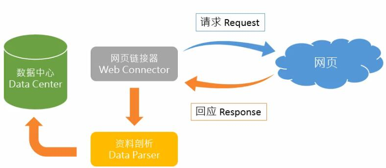

## python 网络爬虫实战

### 课时1 非结构化数据的概念

- 网络中存在大量的非结构化数据
  - 没有固定的数据格式
  - 必须透过ETL(Extract, Transformation, Loading) 工具转化为结构化数据才能取用
- 原始资料(raw data) -> ETL脚本(ETL script) -> 结构化数据(tidy data)

### 课时2 非结构化数据处理与网络爬虫

- 如何处理非结构化数据

  - 借助网络爬虫（不是新技术，比如原始搜索引擎技术）

- 网络爬虫架构

  - 网页链接器向网页发出请求(Request)
  - 网页回应(Response)
  - 可通过**Inspect** in Chrome, Network 来查看Request 和 Response
  - 对回应的资料剖析(Data Parser)
  - 存入数据中心

  

### 课时3 了解网络爬虫背后的秘密

#### 抓取新浪新闻标题和时间

- 使用开发人员工具（Inspect）
- 选择Network，and refresh website
- 用filter筛选Doc类别

> 因为媒体类信息有被搜索引擎抓取的需求，而且Doc类别下最容易被抓取。因此90%的媒体信息都可以在Doc下面找到
>
> 如何确定是否找到了正确的Response？
>
> 看源码里面有无对应信息

- 确认正确的request之后，切换到Headers tag


#### 环境搭建 python 

略

### 撰写第一只网络爬虫

```python
import requests
res=resquests.get("http://news.sina.com.cn/china/")
res.encoding="utf-8" #encoding
print(res.text)
```

结果

```html
<!DOCTYPE html>
<!-- [ published at 2017-02-04 14:45:23 ] -->
<html>
<head>
<meta http-equiv="Content-type" content="text/html; charset=utf-8" />
<title>国内新闻_新闻中心_新浪网</title>
<meta name="keywords" content="国内时政,内地新闻">
<meta name="description" content="新闻中心国内频道，纵览国内时政、综述评论及图片的栏目，主要包括时政要闻、内地新闻、港澳台新闻、媒体聚焦、评论分析。">
<meta name="robots" content="noarchive">
<meta name="Baiduspider" content="noarchive">
<meta http-equiv="Cache-Control" content="no-transform">
<meta http-equiv="Cache-Control" content="no-siteapp">
<!--......-->
```


####  用BeautifulSoup4 剖析网页元素

#### 如何把所获取的数据进行结构化？

- 透过Document Object Model可以将网页转化为DOM Tree， 之后我们可以对DOM Tree的节点进行操作

#### BeautifulSoup4 范例

- 将网页读入BS

```python
from bs4 import BeautifulSoup
html_sample=' \
<html> \
 <body> \
 <h1 id="title">Hello World</h1> \
 <a href="#" class="link">This is link1</a> \
 <a href="# link2" class="link">This is link2</a> \
 </body> \
</html>'
soup=BeautifulSoup(html_sample, "html.parser")
print(soup.text)
```

> **在这段html代码之中， 'h1' 'a' 为‘标签’；id="title", class="link" 为CSS属性，其中id为独一无二，而class可重复**

----

result:

```python
<class 'bs4.BeautifulSoup'>
   Hello World This is link1 This is link2  
```

结果为去掉了所有标签，仅保留了文字部分

但是真正网页之中往往还有大量无用信息

因此下一步为

##### **找出所有含特定标签的HTML元素**

- 使用select找出含有**h1**标签的元素

```python
soup=BeautifulSoup(html_sample,'html.parser')
hearder=soup.select('h1')
print(header)
print(header[0])
print(header[0].text)
```

>  header为python内置的'list'类型
>
>  header[0] 为<class 'bs4.element.Tag'>类型
>
>  header[0].text 为 <class 'str'> 类型

result:

```
[<h1 id="title">Hello World</h1>]
<h1 id="title">Hello World</h1>
Hello World
```

- 使用select找出含有**a**标签的元素

```python
AllLink=soup.select('a')
for link in AllLink:
    print(link.text)
```

result:

```
This is link1
This is link2
```

##### 取得含有特定CSS属性的元素

- 使用select找出所有id为‘title’的元素(id前面需要加#)

```python
atitle=soup.select('#title')
for title in atitle:
    print(title.text)
```

result:

```
Hello World
```

- 使用select找出所有class为‘link’的元素(class前面需要加.)

```python
alink=soup.select('.link')
for link in alink:
    print(link.text)
```

result:

```
This is link1
This is link2
```

##### 取得所有a标签内的链接

- 使用select找出所有a tag的href链接

```python
for link in alinks:
    print(link['href'])
```

result:

```
#
# link2
```

> 实质：dict
>
> ```python
> a='<a href="#" qoo=123 abc=456>this is a link</a>'
> soup2=BeautifulSoup(a,'html.parser')
> print(soup2.select('a')[0]['abc'] )
> print(soup2.select('a')[0]['qoo'] )
> print(soup2.select('a')[0]['href'] )
> ```
>
> result:
>
> ```
> 456
> 123
> 3
> ```
>
> 

##### 注意事项

- soup.select['a']的结果类型为list类型，操作需要先取元素


#### source code： 抓取新浪国内新闻的标题、时间和链接

```python
import requests
res=requests.get("http://news.sina.com.cn/china/")
res.encoding="utf-8" #easy to forget
from bs4 import BeautifulSoup
soup=BeautifulSoup(res.text,"html.parser")#res.text potential error
for news in soup.select(".news-item"):
     if(len(news.select('h2'))>0):
        header=news.select('h2')[0].text
        time=news.select('.time')[0].text
        url=news.select('a')[0]['href']
        print(time,header,url)
        #print(news.select('h2')[0]['href'])#wrong, since href is in tag 'a'
```

result:

```
2月4日 18:45 浙江苍南开近5千人干部大会 人员规模前所未有 http://news.sina.com.cn/o/2017-02-04/doc-ifyafenm2732440.shtml
2月4日 18:36 这个春节国人花了8400亿 银联网络交易达4620亿 http://news.sina.com.cn/o/2017-02-04/doc-ifyaexzn8917810.shtml
2月4日 18:26 南方供暖尝试“破冰”:杭州推天然气分户式供暖 http://news.sina.com.cn/o/2017-02-04/doc-ifyafenm2731114.shtml
2月4日 18:23 全军首个押运兵模拟训练基地建成并投入运行 http://news.sina.com.cn/c/nd/2017-02-04/doc-ifyafcyx6953782.shtml
2月4日 18:22 中国将首次种植全基因组育种芯片新稻种 http://news.sina.com.cn/c/nd/2017-02-04/doc-ifyafcyx6953707.shtml
2月4日 18:19 美对中国钢铁产品作出双反仲裁 商务部表示不满 http://news.sina.com.cn/c/nd/2017-02-04/doc-ifyafcyx6953320.shtml
2月4日 18:17 香港一垃圾站700箱过期薯条遭市民哄抢(图) http://news.sina.com.cn/c/gat/2017-02-04/doc-ifyafcyw0183170.shtml
2月4日 18:12 未成年网络保护条例将出台 专家:电击治疗非法 http://news.sina.com.cn/c/nd/2017-02-04/doc-ifyafcyw0182437.shtml
...
```

### 应对另一种情况：拆分一个大标签下的两部分内容

span 里面镶嵌有 span

```html
<span class="time-source" id="navtimeSource">2017年02月04日22:08		<span>
<span data-sudaclick="media_name"><a href="http://mp.weixin.qq.com/s?__biz=MzIzNjIwNzI2Mw==&amp;mid=2653187721&amp;idx=1&amp;sn=fc0ba8cc8182e718d9e58e58bb6c4421&amp;scene=0#wechat_redirect" rel="nofollow" target="_blank">法制晚报</a></span></span>
</span>
```

---

方法：

```python
a=	'<span class="time-source" id="navtimeSource">2017年02月04日22:08		<span>\
<span data-sudaclick="media_name"><a href="http://mp.weixin.qq.com/s?__biz=MzIzNjIwNzI2Mw==&mid=2653187721&idx=1&sn=fc0ba8cc8182e718d9e58e58bb6c4421&scene=0#wechat_redirect" target="_blank" rel="nofollow">法制晚报</a></span></span>\
	</span>'
soup2=BeautifulSoup(a,'html.parser')
time2=soup2.select('.time-source')[0].contents[0].strip()
from datetime import datetime
objTime2=datetime.strptime(time2,'%Y年%m月%d日%H:%M')#convert string to datetime object
source2=soup2.select('.time-source span a')[0].text
print("at",objTime2,"from",source2)
```

result:

```
at 2017-02-04 22:08:00 from 法制晚报
```


